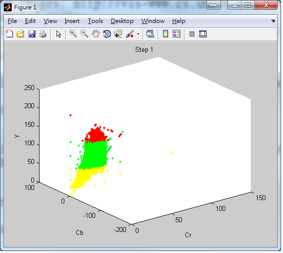

Skin Color Model In YCBCR Color Space
Matlab implementation of paper : Son Lam Phung,Abdesselam Bouzerdoum,and Douglas Chai
Reference : "A novel skin color model in YCbCr color space and its application to human face detection", ICIP 2002.

Required
1.Plot Gaussian ellipsoid: http://www.mathworks.com/matlabcentral/fileexchange/16543-

plot-gaussian-ellipsoid 
2.Dataset 
lfw images: http://vis-www.cs.umass.edu/lfw/lfw-funneled.tgz  
labeled parts: http://viswww.cs.umass.edu/lfw/part_labels/parts_lfw_funneled_gt_images.tgz 

Execution

Please  Gaussian ellipsoid and image in the same folder

Training

Training can only read two experiments, read other photos please change the path

skin distribution in YCbCr 
 

 

Testing

Run test.m

